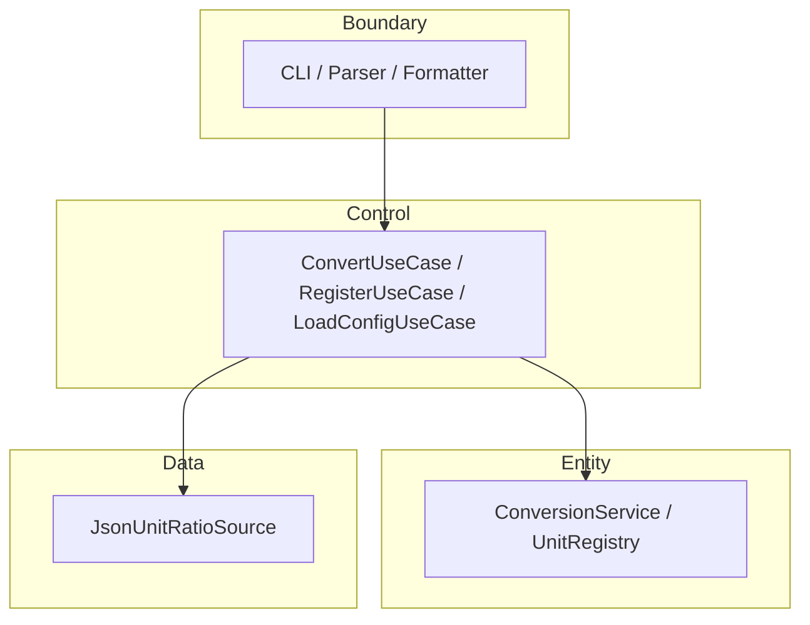

# UnitConverter

**한 줄 설명:** meter 허브 기반 길이 단위를 변환하는 CLI와 Catch2 계약 테스트를 통해, C++ 학습자가 **OCP/SRP·BCE 레이어·TDD**를 증명 가능한 형태로 익히도록 돕는다.


---

## 목차

- [개요 (Overview)](#개요-overview)
- [빠른 시작 (Quick Start)](#빠른-시작-quick-start)
- [지원 단위 및 비율](#지원-단위-및-비율)
- [입력 형식 계약](#입력-형식-계약)
- [아키텍처](#아키텍처)
- [테스트 실행](#테스트-실행)
- [설정 파일 (JSON/YAML)](#설정-파일-jsonyaml)
- [출력 포맷](#출력-포맷)
- [RED 단계 To-Do 리스트](#red-단계-to-do-리스트)
- [Golden Master 회귀 안전장치](#golden-master-회귀-안전장치)
- [기여 가이드 (Contributing)](#기여-가이드-contributing)
- [라이선스](#라이선스)

---

## 개요 (Overview)

### 이 프로젝트가 해결하는 문제

- 단일 파일에 `if-else`와 변환 비율이 섞이면, 단위·출력 포맷이 늘 때마다 **핵심 로직을 반복 수정**해야 한다.
- 입출력 형식, 오류 문구, exit code, 표시용 반올림이 코드에만 있으면 **합의·회귀 검증**이 불다.
- “돌아가는 계산기”와 “**계약·테스트·레이어로 보호되는 시스템**” 사이의 격차를 학습용 저장소에서 메운다.

### 주요 학습 목표

| 목표 | 내용 |
|------|------|
| **OCP** | 새 단위·포맷은 **등록/추가**로 확장; `if (unit == …)` 체인 최소화 |
| **SRP** | 파싱·환산·직렬화·설정 로드를 **Boundary / Control / Entity / Data**로 분리 |
| **BCE** | Dual-Track TDD: Domain RED → Data → Boundary → Integration |
| **TDD** | Catch2로 ε golden, stderr 패턴, exit code, 출력 줄 형식을 **먼저 고정** |

### PRD와의 연결

본 README는 **Phase 5 PRD**의 사용자 대면 요약이다. 입출력·에러·비율의 계약은 PRD §3·§5·§6 및 Gherkin Background와 동기화한다.

→ [docs/PRD.md](docs/PRD.md) · [docs/TODO.md](docs/TODO.md) · [.cursorrules](.cursorrules)

---

## 빠른 시작 (Quick Start)

### 사전 조건

| 항목 | 요구 |
|------|------|
| C++ | **17** 이상 |
| 빌드 | **CMake** 3.16+ |
| 컴파일러 | g++ 또는 clang++ (C++17) |
| 테스트 | **Catch2** (CMake FetchContent 또는 시스템 설치) |
| 포맷 (선택) | clang-format |

### 빌드 & 실행

> 레이어 분리·Catch2 도입 후 아래가 정식 진입점이다. `UnitConverter.cpp` 스타터는 학습 초기 참고용이다.

```bash
cmake -B build -S .
cmake --build build
./build/unit_converter
```

한 줄 입력 예:

```text
meter:5.0
```

### 예시 입출력 (table, 기본)

**입력**

```text
meter:5.0
```

**출력 (stdout, exit 0)**

```text
5.0 meter = 16.4 feet
5.0 meter = 5.5 yard
```

- 좌변은 **입력 값·단위 그대로** 보존한다.
- 우변 target만 **소수 1자리** 반올림한다.
- **입력 단위(meter)는 결과 줄에 포함하지 않는다** (D-UC01).

---

## 지원 단위 및 비율

모든 환산은 **meter equivalence** 경유: `value_B = (value_A × R_A) / R_B`  
Domain 비교 허용 오차: **ε = 1e-9** (절대). 표시는 Boundary에서 target만 1자리.

| 단위명 | 식별자 | meter 기준 비율 (meters per 1 unit) | 출처 |
|--------|--------|-------------------------------------|------|
| meter | `meter` | 1.0 | PRD §5.1 · Gherkin Background |
| feet | `feet` | 0.3048 | PRD §5.1 (≈ 1 m = 3.28084 ft) |
| yard | `yard` | 0.9144 | PRD §5.1 (≈ 1 m = 1.09361 yd) |

---

## 입력 형식 계약

### 정상 입력 (3예시)

| 입력 | 설명 |
|------|------|
| `meter:2.5` | convert — 등록된 다른 단위로 환산 |
| `feet:1` | convert — LHS `1 feet =` 보존 |
| `register:cubit=0.4572` | 동적 등록 — 1 cubit = 0.4572 meter |

**규칙**

- `unit_id`: `[a-z][a-z0-9_]{0,31}`, 앞뒤 trim
- `value`: 유한 십진수, **> 0** (0·음수·non-finite 거부)

### 비정상 입력 (3예시 + 패턴)

| 입력 | exit | stderr 패턴 (human) |
|------|------|---------------------|
| `meter2.5` | 2 | `Invalid format. Use unit:value (ex: meter:2.5)` |
| `meter:abc` | 2 | `Invalid number: abc` |
| `furlong:1` | 3 | `Unknown unit: furlong` |

**추가 (exit 2, stdout 변환 줄 없음)**

| 입력 | stderr |
|------|--------|
| `meter:-1.5` | `Value must be positive: -1.5` |
| `yard:1.2.3` | invalid number (malformed decimal) |
| `register:cubit` | `Invalid register format. Use register:unit=meters_per_unit (ex: register:cubit=0.4572)` |

### exit code

| code | 의미 |
|------|------|
| 0 | 성공 |
| 2 | 형식·숫자·비양수·register·format 옵션 오류 |
| 3 | 미등록 단위 |

---

## 아키텍처

### BCE 레이어



### 의존성 방향

| 허용 | 금지 |
|------|------|
| Boundary → Control | Entity → Boundary / Data / Control |
| Control → Entity, Data | Data → Boundary |
| | Boundary → Entity (직접; 테스트 Facade 제외) |

| 레이어 | 책임 |
|--------|------|
| **Boundary** | 파싱, table/csv/json, stderr·exit, 표시 1자리 |
| **Control** | UseCase, DomainError → exit/메시지 매핑 |
| **Entity** | Registry, meter 환산, 불변식 |
| **Data** | `config/units.json` 로드 |

### 새 단위 추가 (코드 변경 최소화)

1. `config/units.json`의 `units`에 `"<id>": <meters_per_one_unit>` 추가 (양수).
2. 또는 런타임: `register:<unit_id>=<meters_per_unit>`.
3. Catch2로 convert 결과에 새 단위가 **target에만** 나타나는지 확인.
4. **금지:** `main`/Parser에 `if (unit == "…")` 분기 추가.

---

## 테스트 실행

| 항목 | 값 |
|------|-----|
| 프레임워크 | **Catch2** (고정) |
| 레이아웃 | `tests/domain`, `tests/boundary`, `tests/data`, `tests/integration` |
| 패턴 | AAA (Arrange–Act–Assert) |

### 명령

```bash
cmake -B build -S .
cmake --build build
ctest --test-dir build --output-on-failure
```

```bash
./build/unit_converter_tests
```

### 커버리지 목표 (PRD §4.3)

| 레이어 | Line | Branch |
|--------|------|--------|
| entity (Domain) | ≥ 95% | ≥ 90% |
| control | ≥ 90% | ≥ 85% |
| boundary | ≥ 85% | ≥ 80% |
| data | ≥ 90% | ≥ 85% |

**회귀 최소 세트 (5건 상시 green):** Domain P0, IT `meter:2.5` table, IT 음수·형식·unknown unit 실패.

**TDD 순서:** Domain RED → Data → Boundary → Integration (`.cursorrules`).

---

## 설정 파일 (JSON/YAML)

### 위치

| 파일 | 우선순위 |
|------|----------|
| `config/units.json` | 1차 (권장) |
| YAML | 선택 (JSON과 동일 스키마 시) |

### JSON 예시 (v1)

```json
{
  "version": 1,
  "base_unit": "meter",
  "units": {
    "meter": 1.0,
    "feet": 0.3048,
    "yard": 0.9144
  }
}
```

| 규칙 | 내용 |
|------|------|
| `meter` | 필수 |
| `units` 값 | > 0 |
| 로드 실패 | exit ≠ 0, stdout 변환 줄 0 |

### 동적 단위 등록 (PRD §5.3)

```text
register:cubit=0.4572
```

| 결과 | 동작 |
|------|------|
| 성공 | 이후 convert target에 `cubit` 포함 |
| duplicate | 기존 id 재등록 거부, Registry 불변 |
| factor ≤ 0 | 등록 거부 |

---

## 출력 포맷

기본: **table**. 선택: `--format=table|csv|json`.

### 콘솔 (table)

```text
2.5 meter = 8.2 feet
2.5 meter = 2.7 yard
```

줄 패턴: `{source_value} {source_unit} = {target_value} {target_unit}`

### JSON

```json
{
  "source": { "unit": "meter", "value": 2.5 },
  "conversions": [
    { "unit": "feet", "value": 8.2 },
    { "unit": "yard", "value": 2.7 }
  ]
}
```

실패 (`--format=json`): **stdout empty**, stderr 예:

```json
{ "error": "UNKNOWN_UNIT", "unit": "furlong" }
```

### CSV

```csv
source_unit,source_value,target_unit,target_value
meter,2.5,feet,8.2
meter,2.5,yard,2.7
```

| 잘못된 format | 결과 |
|---------------|------|
| `--format=xml` | exit 2, `Unknown output format: xml. Use table, csv, json` |

---

## RED 단계 To-Do 리스트

Domain → Data → Boundary → Integration 순서로 Catch2 RED를 먼저 고정한다. Must-Have·Should-Have 항목 전체는 [docs/TODO.md](docs/TODO.md) 표를 따른다.

---

## Golden Master 회귀 안전장치

> Refactoring 시작 전 구축. GREEN 완료 후 즉시 적용.

### 기준 파일 생성
- [ ] GM-01: golden_master_expected.txt 생성 (meter:2.5 기준 출력)
- [ ] GM-02: feet:1.0 / yard:1.0 / meter:0.0 시나리오 추가
- [ ] GM-03: git add tests/golden_master_expected.txt (버전 관리 포함)

### 테스트 코드
- [ ] GM-04: test_golden_master.cpp + golden_master_expected.txt 작성
- [ ] GM-05: approve 패턴 적용 (파일 없으면 생성, 있으면 비교)
- [ ] GM-06: CMake: add_test(NAME GoldenMaster COMMAND UnitConverter_test) → PASS 확인

### CI 연동
- [ ] GM-07: .github/workflows/golden_master.yml 작성
- [ ] GM-08: PR 머지 차단 (required status check) 설정
- [ ] GM-09: Refactoring 후 Golden Master 재실행 → PASS 확인

---

## 기여 가이드 (Contributing)

### 계약 변경 금지 원칙

- golden·ε·stderr·exit·table 줄 패턴 변경 시 Domain + Boundary + IT **동시** 갱신.
- 표시 1자리 변경은 Boundary 테스트만; Domain ε golden **유지**.
- DomainError ↔ exit ↔ stderr ↔ JSON error **단일 매핑 테이블** 유지 (RR-2).

### 테스트 없는 PR 거부

- 동작·계약 변경은 **Catch2 필수**.
- assertion 삭제·완화·ε 임의 확대 **거부**.
- `regression_minimum` 5건 green 없이 merge **금지**.

### 커밋 메시지

```text
<type>(<scope>): <subject>
```

| type | 용도 |
|------|------|
| `test` | Catch2 RED/GREEN |
| `feat` | 계약 충족 (scope: entity, boundary, control, data) |
| `refactor` | 테스트 green 후 구조만 |
| `docs` | README·PRD |
| `fix` | 계약 버그 (IT ID 명시) |

---

## 라이선스

MIT License — **학습용** 오픈소스 실습 프로젝트.

---

*Phase 6 README · Phase 5 PRD 동기화. 구현·인수 상태는 [docs/TODO.md](docs/TODO.md) 참고.*
