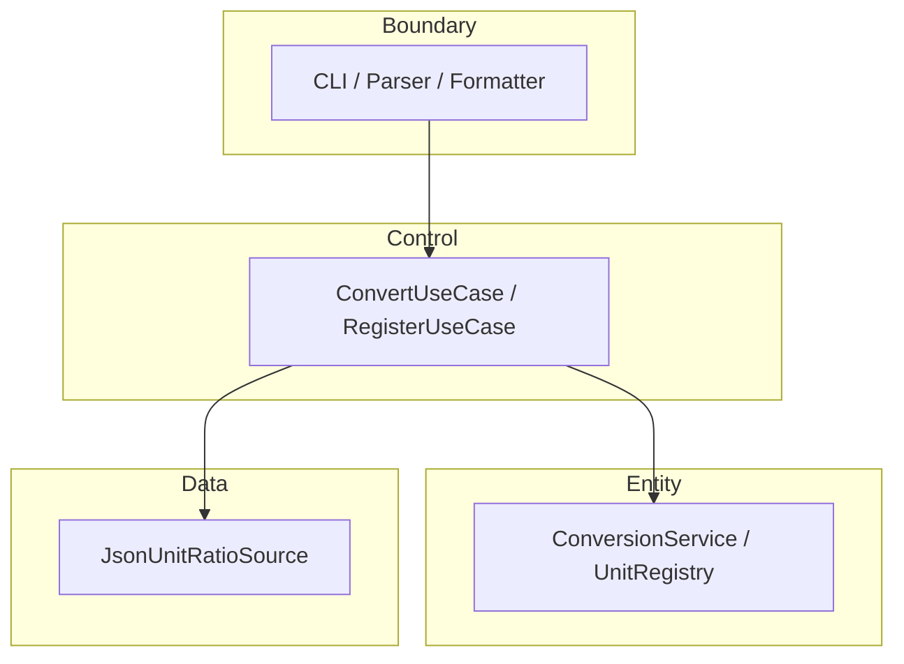

# UnitConverter — 확장 가능한 C++ 길이 단위 변환 학습 프로젝트

**한 줄 설명:** meter 허브 기반 길이 단위를 변환하는 CLI와 Catch2 계약 테스트를 통해, C++ 학습자가 **OCP/SRP·BCE 레이어·TDD**를 증명 가능한 형태로 익히도록 돕는다.


---

## 목차

- [개요 (Overview)](#개요-overview)
- [빠른 시작 (Quick Start)](#빠른-시작-quick-start)
- [지원 단위 및 비율](#지원-단위-및-비율)
- [입력 형식 계약](#입력-형식-계약)
- [아키텍처](#아키텍처)
- [테스트 실행](#테스트-실행)
- [설정 파일 (JSON/YAML)](#설정-파일-jsonyaml)
- [출력 포맷](#출력-포맷)
- [기여 가이드 (Contributing)](#기여-가이드-contributing)
- [라이선스](#라이선스)

---

## 개요 (Overview)

### 이 프로젝트가 해결하는 문제

- 단일 파일에 `if-else`와 변환 비율이 섞이면, 단위·출력 포맷이 늘 때마다 **핵심 로직을 반복 수정**해야 한다.
- 입출력 형식, 오류 문구, exit code, 표시용 반올림이 코드에만 있으면 **합의·회귀 검증**이 불가능하다.
- “돌아가는 계산기”와 “**계약·테스트·레이어로 보호되는 시스템**” 사이의 격차를 학습용 저장소에서 메운다.

### 주요 학습 목표

| 목표 | 내용 |
|------|------|
| **OCP** | 새 단위·포맷은 **등록/추가**로 확장, 기존 환산 공식·`if (unit == …)` 체인 변경 최소화 |
| **SRP** | 파싱·환산·직렬화·설정 로드를 **Boundary / Control / Entity / Data**로 분리 |
| **BCE** | Dual-Track: Domain RED → Boundary/Data → Integration |
| **TDD** | Catch2로 불변식(ε), stderr 패턴, exit code, 출력 줄 형식을 **먼저 고정** |

### PRD와의 연결

본 README는 **Phase 5 PRD**의 사용자 대면 요약이며, 입출력·에러·비율의 **단일 출처**는 PRD §3·§5·§6 및 Gherkin Background와 동기화한다.

→ 상세 추적·인수 기준: [docs/PRD.md](docs/PRD.md) · 기계 규칙: [.cursorrules](.cursorrules)

---

## 빠른 시작 (Quick Start)

### 사전 조건

| 항목 | 버전 |
|------|------|
| C++ | **17** 이상 |
| 빌드 | **CMake** 3.16+ |
| 컴파일러 | g++ / clang++ (C++17 지원) |
| 테스트 | **Catch2** (CMake FetchContent 또는 시스템 설치) |
| 포맷 (선택) | clang-format |

### 빌드 & 실행

> **참고:** 레이어 분리·Catch2 도입 후 아래 CMake 흐름이 정식 진입점이다. 스타터 단일 파일(`UnitConverter.cpp`)은 학습 초기 참고용이다.

```bash
cmake -B build -S .
cmake --build build
./build/unit_converter
```

대화형 한 줄 입력 예:

```text
meter:5.0
```

### 예시 입출력 (table, 기본)

**입력**

```text
meter:5.0
```

**출력 (stdout, exit 0)**

```text
5.0 meter = 16.4 feet
5.0 meter = 5.5 yard
```

- 좌변 `{값} {단위}`는 **입력 그대로 보존**한다.
- 우변 `target` 값만 **소수 1자리** 반올림한다.
- **입력 단위(meter)는 결과 줄에 포함하지 않는다.**

### 포맷·설정 옵션 (권장 기능)

```bash
./build/unit_converter --format=json
./build/unit_converter --format=csv
```

---

## 지원 단위 및 비율

**허브:** meter — 모든 환산은 `meters_per_one_unit`으로 meter 환산 후 대상 단위로 변환한다.

| 표시명 | 식별자 (`unit_id`) | meters per 1 unit | README 등가 | 출처 |
|--------|-------------------|-------------------|-------------|------|
| meter | `meter` | 1.0 | 기준 | PRD 5.1 · Gherkin Background |
| feet | `feet` | 0.3048 | 1 m = 3.28084 ft | PRD 5.1 · Domain golden은 full precision |
| yard | `yard` | 0.9144 | 1 m = 1.09361 yd | PRD 5.1 |

**Domain 검증:** `value_B = (value_A × R_A) / R_B`, 비교 허용 오차 **ε = 1e-9** (절대).

**표시(Table/CSV/JSON 권장):** target만 소수 **1자리** — 예: `2.5 m → 8.2 ft` (내부값 8.2021…).

---

## 입력 형식 계약

### 정상 입력 예시 (3)

| 입력 | 의미 |
|------|------|
| `meter:2.5` | convert — 2.5 meter를 다른 등록 단위로 |
| `feet:1` | convert — 1 feet (LHS `1 feet =` 보존) |
| `register:cubit=0.4572` | 동적 등록 — 1 cubit = 0.4572 meter |

- `unit_id`: `[a-z][a-z0-9_]{0,31}`, 앞뒤 공백 trim.
- `value`: 유한 십진수, **반드시 > 0**.

### 비정상 입력 예시 (3) + 에러 패턴

| 입력 | exit | stderr 패턴 (human) |
|------|------|---------------------|
| `meter2.5` (콜론 없음) | **2** | `Invalid format. Use unit:value (ex: meter:2.5)` |
| `meter:abc` | **2** | `Invalid number: abc` |
| `furlong:1` (미등록) | **3** | `Unknown unit: furlong` |

**추가 거부 (동일 정책, exit 2, stdout 변환 줄 없음):**

| 입력 | stderr |
|------|--------|
| `meter:-1.5` | `Value must be positive: -1.5` (또는 JSON `NON_POSITIVE_VALUE`) |
| `feet:0` | `Value must be positive: 0` |
| `register:cubit` | `Invalid register format. Use register:unit=meters_per_unit (ex: register:cubit=0.4572)` |

### exit code 요약

| code | 의미 |
|------|------|
| 0 | 성공 |
| 2 | 형식·숫자·비양수·register 문법·format 옵션 오류 |
| 3 | 미등록 단위 |

---

## 아키텍처

### BCE 레이어



### 의존성 방향

| 허용 | 금지 |
|------|------|
| Boundary → Control | Entity → Boundary / Data / Control |
| Control → Entity, Data | Data → Boundary |
| | Boundary → Entity (직접, 테스트 Facade 제외) |

| 레이어 | 책임 |
|--------|------|
| **Boundary** | `unit:value` 파싱, table/csv/json, stderr·exit, **표시 1자리** |
| **Control** | UseCase, DomainError → exit/메시지 매핑 |
| **Entity** | Registry, meter 환산, 불변식 |
| **Data** | `config/units.json` 로드 |

### 새 단위 추가 방법 (코드 변경 최소화)

1. **설정으로 추가 (권장):** `config/units.json`의 `units`에 `"<id>": <meters_per_one_unit>` 추가 (양수).
2. **런타임 등록:** `register:<unit_id>=<meters_per_unit>` 한 줄 입력.
3. **확인:** `meter:2.5` 등 convert — 새 단위가 **target 줄에만** 나타나는지 Catch2 IT로 검증.
4. **하지 않을 것:** `main` 또는 Parser에 `if (unit == "…")` 분기 추가 (OCP 위반).

---

## 테스트 실행

| 항목 | 값 |
|------|-----|
| 프레임워크 | **Catch2** (다른 프레임워크 사용 금지) |
| 레이아웃 | `tests/domain`, `tests/boundary`, `tests/data`, `tests/integration` |

### 명령

```bash
cmake -B build -S .
cmake --build build
ctest --test-dir build --output-on-failure
```

특정 실행 파일만:

```bash
./build/unit_converter_tests
```

### 커버리지 목표 (PRD 4.3)

| 레이어 | Line | Branch |
|--------|------|--------|
| entity (Domain) | ≥ 95% | ≥ 90% |
| control | ≥ 90% | ≥ 85% |
| boundary | ≥ 85% | ≥ 80% |
| data | ≥ 90% | ≥ 85% |

**회귀 최소 세트 (상시 green):** Domain P0 환산·길이 검증, IT `meter:2.5` table, 음수/형식/unknown unit 실패 3건.

**TDD 순서:** Domain RED → Data → Boundary → Integration (`.cursorrules` `tdd_rules`).

---

## 설정 파일 (JSON/YAML)

### 위치

| 파일 | 우선순위 |
|------|----------|
| `config/units.json` | **1차 (권장)** |
| YAML | 선택 (JSON과 스키마 동일 시) |

### JSON 형식 예시 (v1)

```json
{
  "version": 1,
  "base_unit": "meter",
  "units": {
    "meter": 1.0,
    "feet": 0.3048,
    "yard": 0.9144
  }
}
```

| 규칙 | 내용 |
|------|------|
| `units` 값 | **> 0** (meters per 1 unit) |
| `meter` | 필수 |
| parse/schema 실패 | exit ≠ 0, **stdout 변환 줄 0** |

### 동적 단위 등록 (PRD 5.3)

**문법**

```text
register:<unit_id>=<positive_decimal>
```

**예**

```text
register:cubit=0.4572
```

| 결과 | 설명 |
|------|------|
| 성공 | 이후 convert의 target에 `cubit` 포함 |
| duplicate | `feet` 등 기존 id 재등록 **거부** (Registry 불변) |
| factor ≤ 0 | 등록 거부 |

---

## 출력 포맷

기본: **table**. 선택: `--format=table|csv|json`.

### 콘솔 (table) — PRD 6.1 / 6.4

**규칙:** 한 줄 = `{source_value} {source_unit} = {target_value} {target_unit}`

```text
2.5 meter = 8.2 feet
2.5 meter = 2.7 yard
```

### JSON — PRD 6.2

**성공 (stdout):**

```json
{
  "source": { "unit": "meter", "value": 2.5 },
  "conversions": [
    { "unit": "feet", "value": 8.2 },
    { "unit": "yard", "value": 2.7 }
  ]
}
```

**실패 (`--format=json`):** stdout empty, stderr 예:

```json
{ "error": "UNKNOWN_UNIT", "unit": "furlong" }
```

### CSV — PRD 6.3

```csv
source_unit,source_value,target_unit,target_value
meter,2.5,feet,8.2
meter,2.5,yard,2.7
```

| format | 거부 예 |
|--------|---------|
| `xml` 등 | exit **2**, `Unknown output format: xml. Use table, csv, json` |

---

## 기여 가이드 (Contributing)

### 계약 변경 금지 원칙

- **golden 비율·ε**, **stderr 문구**, **exit code**, **table 줄 패턴** 변경 시: Domain + Boundary + IT **동시** 갱신.
- **표시 1자리** 변경은 Boundary 테스트만; Domain full precision **유지**.
- DomainError ↔ exit ↔ stderr ↔ JSON error **단일 매핑 테이블** 유지.

### 테스트 없는 PR 거부 정책

- 동작·계약 변경 PR은 **Catch2 테스트 추가/수정 필수**.
- RED 없이 통과만 맞춘 PR, assertion 삭제·완화, ε 임의 확대 **거부**.
- `regression_minimum` 5건 **green** 없이 merge하지 않음.

### 커밋 메시지 컨벤션

```text
<type>(<scope>): <subject>

<body: what contract / test ID>
```

| type | 용도 |
|------|------|
| `test` | Catch2 추가·RED/GREEN |
| `feat` | 계약 충족 기능 (layer 명시) |
| `refactor` | 동작 동일, 테스트 green 후만 |
| `docs` | README·PRD·Gherkin |
| `fix` | 계약 위반 버그 (IT ID 참조) |

**scope 예:** `entity`, `boundary`, `control`, `data`, `integration`

---

## 라이선스

MIT License — **학습용** 오픈소스 실습 프로젝트.

---

## 부록 — 6시간 Activities (생성형 AI 활용)

| 단계 | 시간 | 내용 |
|------|------|------|
| 1 | 0.5h | 스타터·계약·Gherkin 분석 |
| 2 | 2h | OCP/SRP·입력 검증·Entity/Boundary |
| 3 | 0.5h | Catch2 TC (환산·검증) |
| 4 | 2h | 설정·동적 등록·출력 포맷 + TC |
| 5 | 1h | 회고·발표 (TDD·AI 활용·리팩터) |

---

*문서 버전: Phase 6 (README) — Phase 5 PRD 동기화. 구현 상태는 레이어·테스트 도입 진행에 따라 [docs/PRD.md](docs/PRD.md) 인수 체크리스트를 참고하세요.*
